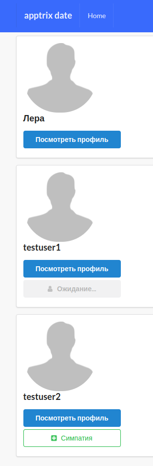

1. Create django-project, create model Profile
2. Create login with django-allauth 
Login page - https://gentle-everglades-31954.herokuapp.com/accounts/login
Profile page - https://gentle-everglades-31954.herokuapp.com/profiles/myprofile/ (can update info)
3. Create method to add watermark on avatar
4. Create class Relationship and methods for liking between users
https://gentle-everglades-31954.herokuapp.com/profiles/all_profiles/ - list of all profiles
https://gentle-everglades-31954.herokuapp.com/profiles/{id} - profiles detail
https://gentle-everglades-31954.herokuapp.com/profiles/my_match/ - list of received likes

Add mail-function in method of Relationship
5. Add lib django-filters for search by users gender, first name, last name.
https://gentle-everglades-31954.herokuapp.com/profiles/all_profiles/